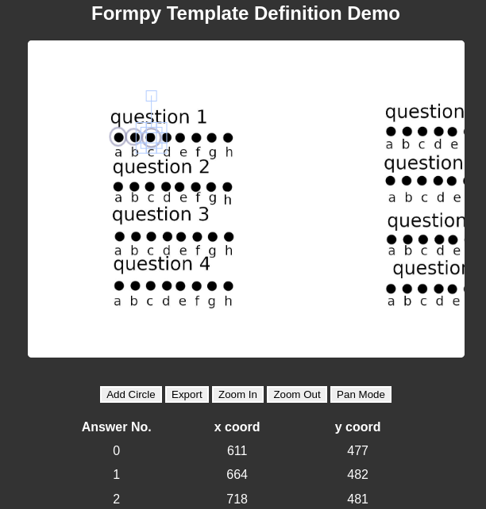

# improving UI for formpyapp

formpyapp currently uses contour detection to find filled in spots in a template to find the coordinates for answers and define the template.

However this requires the user to have a prefilled template so the answers can be correctly detect - detracting away from user experience

using fabricjs the user can now overlay the template image with circles to identify the answers in the template

[fabricjs](http://fabricjs.com/) is a "powerful and simple Javascript HTML5 canvas library" to abstract away the lower level HTML 5 canvas API and without losing access to the key components needed, in this case the x,y coordinates of the objects are sent to the server to define the templates.

